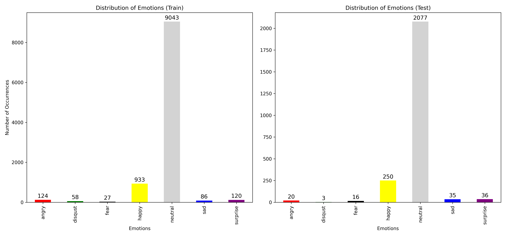
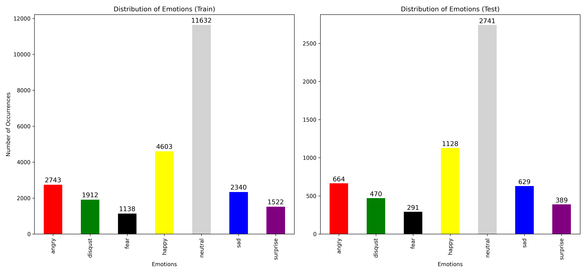

# Emo-Ensemble
[Competition] [제 2회 ETRI 휴먼이해 인공지능 논문경진대회](https://aifactory.space/competition/qna/2234/1019)  
[Paper] Emo-Ensemble: An Ensemble-based Multimodal Emotion Recognition using wav2vec2 and KoBERT

## Original Data Source
[KEMDy20] [한국어 멀티모달 감정데이터셋 2020](https://nanum.etri.re.kr/share/kjnoh/KEMDy20?lang=ko_KR)  
  

[AI Hub] [감정 분류를 위한 대화 음성 데이터셋](https://aihub.or.kr/aihubdata/data/view.do?currMenu=115&topMenu=100)  

## Environment

## Directory (Local)

## Directory (Colab)

## Pretrained Model info

### wav2vec2

### KoBERT

## Benchmark Model info
[MMM: Multi-modal Emotion Recognition in conversation with MLP Mixer](https://github.com/ISDS-Human-Understanding/HumanUnderstandingOpen)

## Emo-Ensemble hyper-parameters

### wav2vec2

### KoBERT

## Model Architecture

## Experiment results

### Fig 1. Class distribution (KEMDy20)

### Fig 2. Class distribution (KEMDy20 + AI Hub)

